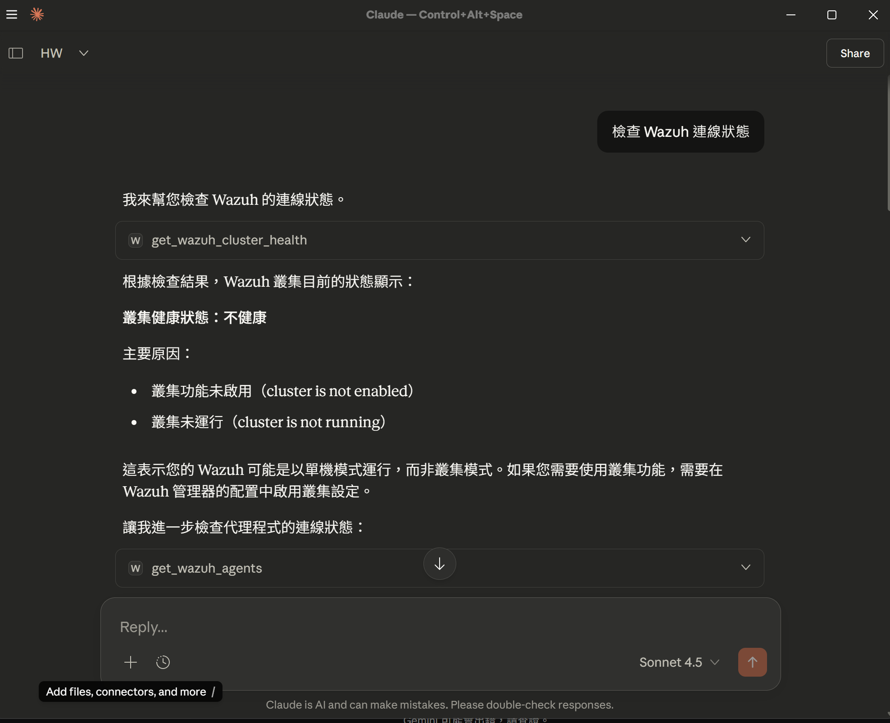
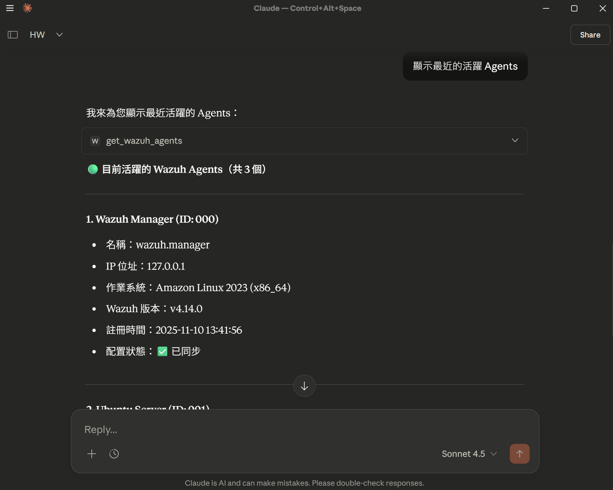
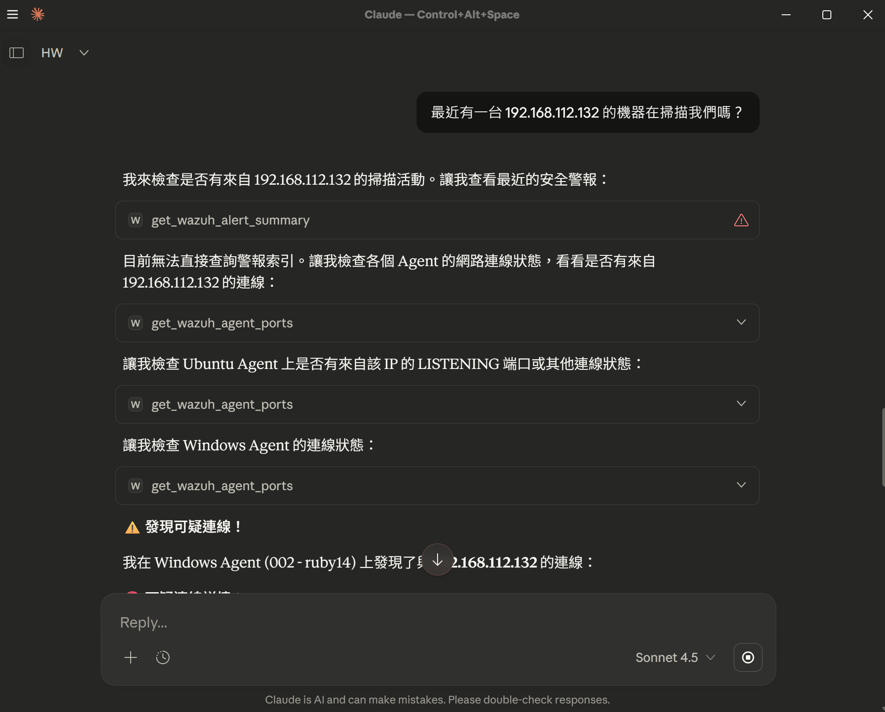
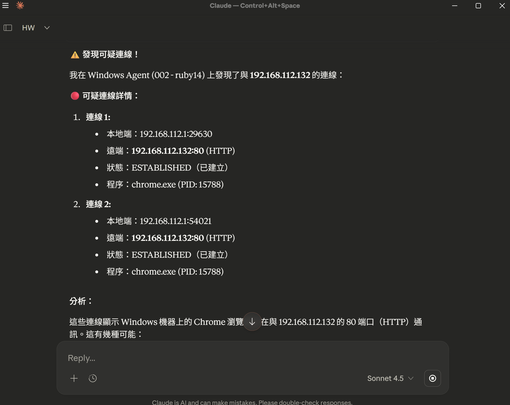
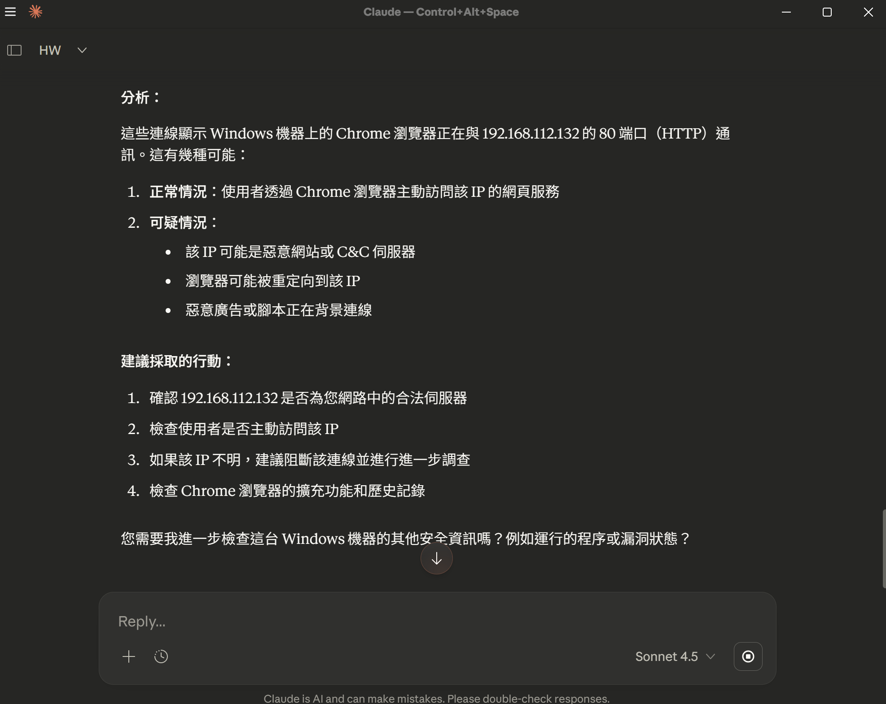
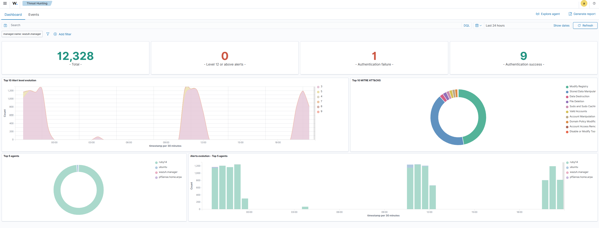

# Wazuh-MCP-Threat-Hunting-Demo
Demo of using MCP server for Wazuh to perform AI-assisted threat hunting.
# Wazuh MCP Threat Hunting Demo

## Project Overview (專案簡介)
This project demonstrates how to use the **Wazuh MCP Server** to integrate Wazuh logs with an LLM Agent. By using natural language via chat interfaces, we can perform threat hunting and query security alerts without manually navigating the Wazuh dashboard.

- **Tools Used:** Wazuh, MCP Server, [Mention your LLM tool, e.g., LangChain/Claude Desktop/OpenAI]
- **Target:** Detect Nmap scanning activity via Chat.

## Architecture (架構)
1. **Wazuh Manager:** Collects security logs and alerts.
2. **MCP Server:** Bridges the LLM with the Wazuh API.
3. **User Client:** Interacts with the system using natural language queries.

## Threat Hunting Demo (功能展示)

### Scenario: Detecting Network Scanning
I performed an Nmap scan against the Wazuh agent. Instead of checking the dashboard, I asked the AI Agent to identify threats.

#### 1. The Query & Threat Hunting Process (對話查詢過程)
I interacted with the Wazuh MCP agent to analyze the security status. The agent successfully identified the agents and retrieved relevant logs.

*Checking agent status and connection.*

*Getting agent summary details.*

*Investigating specific security events.*

*Drilling down into specific alert details.*

*Final analysis and summary.*

#### 2. Verification in Wazuh (Wazuh 後台驗證)
Verifying the data in the Wazuh Dashboard.

*(Upload your wazuh dashboard screenshot and name it wazuh_dashboard.png)*

## Conclusion
Using MCP protocol allows for rapid incident triage. The AI agent can effectively filter noise and present relevant security alerts from Wazuh.

## References
- [mcp-server-wazuh GitHub](https://github.com/gbrigandi/mcp-server-wazuh)
